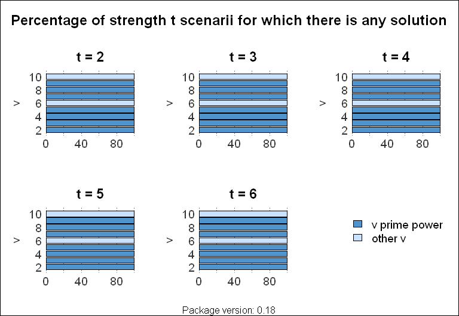
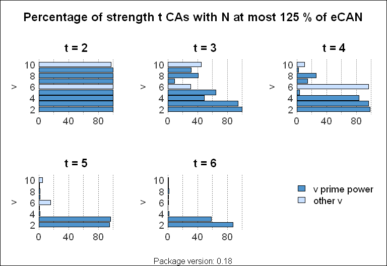
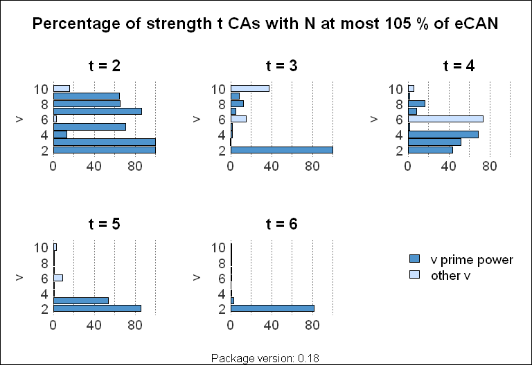
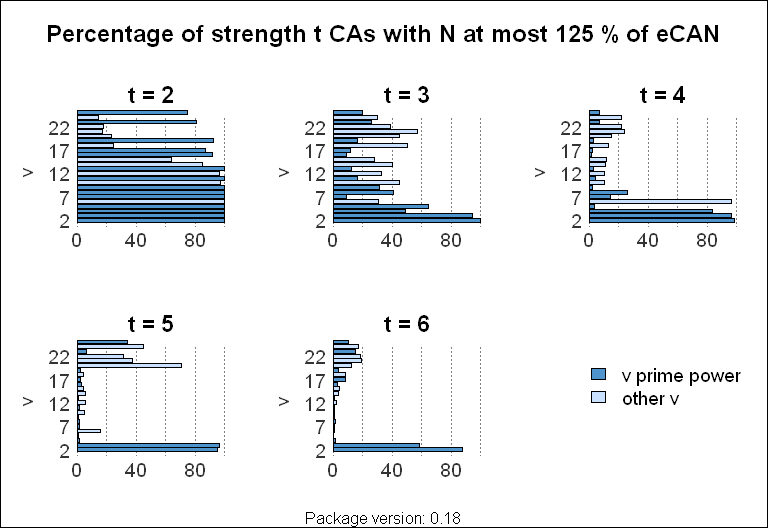
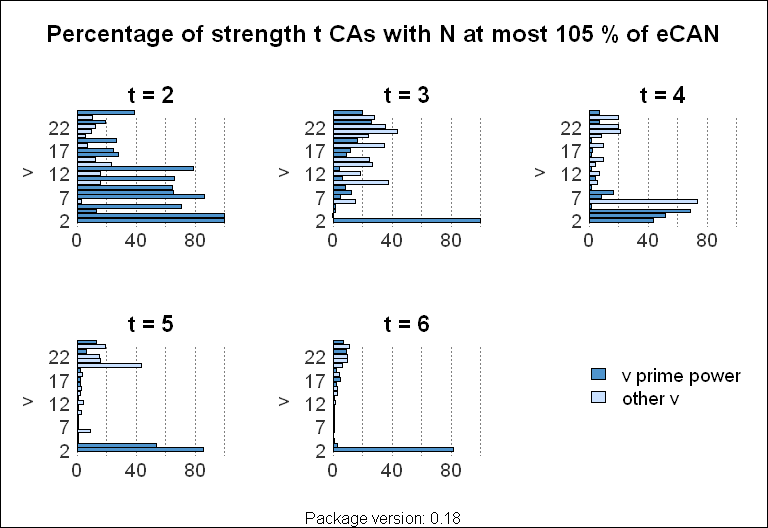

<!--- DO NOT EDIT:  AUTOMATICALLY GENERATED from README.Rmd -->

# CAs

Creates covering arrays.

- **Author**: Ulrike Groemping, BHT Berlin.
- **License**: GPL-3
- **Version**: 0.22

[](https://codecov.io/github/ugroempi/CAs)

## Warning

This is a very preliminary version of R package **CAs**. Changes that
break backwards compatibility can and will occur without warning.
Important changes/bug fixes are stated in the
[NEWS](https://github.com/ugroempi/CAs/blob/main/inst/NEWS.md) file, but
no guarantees!

## Installation

**CAs** is not yet on [CRAN](https://CRAN.R-project.org). If you want to
work with this very preliminary version (see above warning), you can
install the latest status of the package from this repository with:

``` r
if (!require(devtools)) install.packages("devtools")
devtools::install_github("ugroempi/CAs")
```

or obtain a specific frozen status via a tag (so far the only tag is
`v0.21` for version 0.21):

``` r
devtools::install_github("ugroempi/CAs", ref="v0.21")
```

## Details

*At the end of this README file, charts depict the current status of
array implementation relative to the empirical covering array numbers
(eCANs) of the Colbourn tables, for v up to 10.*

This package constructs covering arrays, i.e., arrays that cover all
$`t`$-ary combinations of a set of factors at least once. The focus is
on mathematical constructions. Initially, the package only offers arrays
for which all columns have the same number of levels.

The goal is to implement as many constructions as possible that yield
arrays with small numbers of runs, as evidenced by the Colbourn covering
array tables, which do not provide the CAs themselves but pointers to
which CA constructions yield the smallest known array for which setting.

All references of the package are listed in this file and referenced
from the other documentation files.

Within the package, available CA constructions for specific situations
can be queried using the function <code>Ns</code>, which provides sizes
from available constructions, as well as the current known optimum size;
it is not guaranteed that all implemented constructions are
incorporated, as this is not trivial for constructions with intricate
ingoing quantities. An analogous function <code>ks</code> is far less
advanced, as the typical application situation presumably starts from a
set of variables to be covered.

Function <code>bestCA</code> makes use of function <code>Ns</code> (with
the above-stated limitations) and produces the best currently
implemented design, including a download from internet libraries, where
applicable.

Besides the construction functions, coverage properties of any array can
be checked by function <code>coverage</code> and plotted by function
<code>coverplot</code>.

So far, the following constructions for uniform CAs have been
implemented:
<ul>

<li>

strength 2 2-level CAs by Kleitman and Spencer (1973) and Katona (1973)
in function <code>KSK</code>,
</li>

<li>

strength 3 to 6 2-level constructions via Paley matrices according to
Colbourn (2015) in function <code>paleyCA</code>,
</li>

<li>

orthogonal arrays from a Bose (1938) or Bush (1952) construction in
functions <code>SCA_Bose</code> and <code>SCA_Busht</code>; the latter
does one more column for strength 3 with <code>q</code> a power of 2,
according to the Sherwood, Martirosyan and Colbourn (2006) example for
the usage of permutation vectors.
</li>

<li>

constructions based on cyclotomy (Colbourn 2010) in function
<code>cyclotomyCA</code> for practitioners (based on arrays listed in
the Colbourn tables), and function <code>cyc</code> for experts who know
which prime power and construction type to request for which strength.
</li>

<li>

Chateauneuf and Kreher (2002) doubling in function
<code>CK_doublingCA</code> (workhorse function <code>CK_doubling</code>)
</li>

<li>

strength 3 CAs for v=3,4,5 with up to 2v columns in 33, 88 or 185 runs
(<code>miscCA</code>)
</li>

<li>

strength 3 CAs for v=q+1 with q a prime power, and k\<=v, based on
augmenting an ordered design with further runs (Cohen, Colbourn and Ling
2003 and 2008)
</li>

<li>

the Colbourn and Torres-Jimenez (2010) power construction in function
<code>powerCA</code>
</li>

<li>

the Sherwood, Martirosyan and Colbourn (2006) construction based on
SCPHFs and permutation vectors, including not only the SCPHFs from the
Sherwood et al. paper but also those provided by Walker and Colbourn
(2009) and by Lanus (based on Colbourn and Lanus 2018 and Colbourn,
Lanus and Sarkar 2018) in function <code>scphfCA</code>
</li>

<li>

the construction based on CPHFs using CPHFs from Wagner, Colbourn and
Simos (2022) in function <code>cphfCA</code>
</li>

<li>

Colbourn et al. (2010, CKRS) cross-sum of an <code>N x k</code> code
with a strength t-1 CA to yield a strength t CA
</li>

<li>

recursive Bose constructions using <code>productPCA</code> or
<code>productCA</code>, implemented in functions
<code>recursiveBose</code> and <code>recBoseCA</code>; the variant with
<code>link{productPCA}</code> is uniformly better than a similar
construction of Hartman (2005, Theorem 7.1 and Corollary 7.2).
</li>

<li>

a fusion construction based on a Bose matrix, from Colbourn (2008), in
function <code>fuseBoseCA</code>
</li>

<li>

a fusion construction based on a Bush matrix, from Colbourn (2008), in
function <code>fuseBushtCA</code>
</li>

<li>

a projection construction based on a Bose matrix, from Colbourn (2008),
in functions <code>projectionBose</code> and <code>projBoseCA</code>
</li>

<li>

the group-based strength 2 construction by Meagher and Stevens (2005)
which uses starter vectors and a group of cycling permutations that
leaves one value fixed (function <code>CS_MS</code>)
</li>

<li>

the strength 2 cover starter construction by Lobb et al. (2012) which
works similarly to Meagher and Stevens (2005) but fix one or more
symbols using the additive group on the non-fixed symbols (function
<code>CS_LCDST</code>)
</li>

<li>

the strength 2 cover starter construction by Colbourn et al. (2006)
which is simpler than Meagher and Stevens (2005) and allows a recursive
product construction (function <code>CS_CMMSSY</code>)
</li>

<li>

the 2-level cover starter construction by Colbourn and Keri (2009),
which creates strength 4, 5, and 6 CAs and is also closely related to
the Paley type construction of Colbourn (2015)
</li>

<li>

direct product construction for strength 2 CAs in function
<code>productCA</code>, with generalizations for slightly reducing the
number of runs
</li>

<li>

product construction for strength 2 PCAs in <code>productPCA</code>,
proposed by Colbourn et al. (2006), improved by Colbourn and
Torres-Jimenez (2013); automated in function <code>dpCA</code> based on
some ingredients; the construction is behind various current best CAs of
the Colbourn tables, which are not yet achieved by the package.
</li>

<li>

adding a column, as detailed in Theorem 3.2 of Colbourn et al. (2010,
CKRS)
</li>

<li>

composition of arrays, i.e., cross product of levels for arbitrary
strength (e.g., Theorem 2.8 of Zhang et al. 2014),
<code>crossCAs</code>; automated in function <code>pcaCA</code> based on
some ingredients
</li>

<li>

the CA EXtender for strength 2 3-level CAs (Torres-Jimenez,
Acevedo-Juarez and Avila-George 2021), which yields the current best
arrays for all scenarii (but, contrary to the 2-level case, these arase
not theoretically optimal and might improve in the future) in function
<code>CAEX</code>.
</li>

<li>

identification of flexible values as in Colbourn and Torres-Jimenez
(2013), and the Nayeri et al. (2013) postprocessing in function
<code>postopNCK</code>
</li>

</ul>

So far, there are three functions for mixed level CAs: <code>MCA2</code>
implements a strength 2 construction, generalized from Sherwood (2008)
by Groemping (2025), that is based on expanding some columns of a (mixed
or) uniform CA, after reducing their number of levels, by replacing the
flexible values of those columns with suitable small matrices and
replicating the rest of those columns the corresponding number of times.
Its details can be found in Groemping (2025).<br />
<code>CA_to_MCA</code> takes a uniform (or mixed level) array, removes
levels (makes them flexible) as required.<br /> Both constructions may
benefit from subsequent removal of as many rows as possible via the
Nayeri et al. (2013) construction. For <code>CA_to_MCA</code>, this is
the crucial step; for <code>MCA2</code>, gains are less dramatic, but
still often relevant.<br /> <code>projBoseMCA</code> implements the
mixed level construction by Stevens, Ling and Mendelsohn (2002) in the
form stated by Colbourn (2008) in his Corollary 2.2, and the
construction of Colbourn’s Theorem 2.3.

## Exported objects

The constructions are based on various catalogue objects and occasional
arrays that can be inspected by expert users, but are mainly meant to be
used by the package functions:
<ul>

<li>

<code>colbournBigFrame</code>,
</li>

<li>

<code>CAEX_CAs</code> and <code>CAEX_lineages</code>,
</li>

<li>

<code>TJcat</code> and <code>TJ2level_CAs</code>,
</li>

<li>

<code>powerCTcat</code>,
</li>

<li>

<code>PCAcat</code>
</li>

<li>

<code>DPcat</code>
</li>

<li>

<code>SCPHFcat</code>, <code>SMC_SCPHFs</code>, <code>CL_SCPHFs</code>,
<code>WC_SCPHFs</code>
</li>

<li>

<code>CPHFcat</code> and <code>WCS_CPHFs</code>
</li>

<li>

<code>MeagherStevensCombis</code> and
<code>MeagherStevensStarters</code>,
</li>

<li>

<code>CMMSSYCombis</code> and <code>CMMSSYStarters</code>,
</li>

<li>

<code>LCDSTCombis</code> and <code>LCDSTStarters</code>,
</li>

<li>

<code>ColbournKeriCombis</code> and <code>ColbournKeriStarters</code>,
</li>

<li>

<code>CKRScat</code> and <code>CKRS_CAs</code>,
</li>

<li>

<code>WKScat</code>, <code>WKS_CAs</code>,
</li>

<li>

<code>PALEYcat</code>, <code>CYCLOTOMYcat</code>, <code>DWYERcat</code>,
<code>NISTcat</code>, <code>miscCAcat</code>, and individual arrays
named in the latter.
</li>

</ul>

The arrays referenced by <code>DWYERcat</code> and <code>NISTcat</code>
can only be accessed with an internet connection.

The R objects are available in the <code>data</code> folder of the
package, corresponding raw data and construction code can be found in
the <code>extdata</code> folder of the package, which can be located in
the directory <code>inst/extdata</code> of the GitHub repo or, for a
given R installation, using <code>system.file(“extdata”,
package=“CAs”)</code> from within R.

## Current status of package implementation (for uniform CAs only)

The figures show performance percentages relative to the best-known
arrays as collated by Colbourn, status November 2024; there are figures
for up to 10 levels and figures for up to 25 levels; the reference
scenarii are created as the union of situations for which NIST (2008)
has arrays ($`t=2,\dots,6`$, $`v=2,\dots,6`$ but not both 6, with $`k`$
up to 2000 for $`t=2`$ and $`t=3`$ with $`v`$ up to 4, and decreasing
maximum $`k`$ for larger $`t`$ and $`v`$) − these have an array for each
individual $`k`$ − and the Colbourn table entries for $`t=2,\dots,6`$,
$`v=2,\dots,25`$ and $`k`$ only where the necessary $`N`$ increases for
the scenario; these are limited to situations with $`N\le1.000.000`$.
This choice was based on convenience and could certainly be improved.
For large $`v`$ (far outside of the NIST domain), the relative
performance improves versus medium $`v`$; this is presumably due to a
worse status of best-known arrays, not to a better status of
implementation in the package.

<!-- --><!-- --><!-- --><!-- --><!-- --><!-- --><!-- --><!-- -->

## References

**The Colbourn Covering array tables are currently unavailable at their
usual location; temporarily, access is provided**
[here](https://github.com/ugroempi/CAs/blob/main/ColbournTables.md).

<p>

Ball, W. W. R. and Coxeter, H. S. M. (1987). Mathematical Recreations
and Essays, 13th ed. New York: Dover, pp. 308-309.
</p>

<p>

Bose, R.C. (1938). On the application of the properties of Galois fields
to the problem of construction of hyper-Graeco-Latin squares. Sankhya 3,
323-338.
</p>

<p>

Bush, K.A. (1952). Orthogonal Arrays of Index Unity. Annals of
Mathematical Statistics 23, 426-434.
</p>

<p>

Chateauneuf, M., Colbour.n, C. and Kreher, D.L. (1999). Covering Arrays
of Strength Three. Des. Codes Cryptogr. 16, 235-242.
</p>

<p>

Chateauneuf, M. and Kreher, D.L. (2002). On the state of strength‐three
covering arrays. Journal of Combinatorial Designs, vol. 10, no. 4,
pp. 217-238. doi: 10.1002/jcd.10002.
</p>

<p>

Cohen, M.B., Colbourn, C.J., Ling, A.C.H. (2003). Augmenting simulated
annealing to build interaction test suites, in: 14th International
Symposium on Software Reliability Engineering, 2003. ISSRE 2003. IEEE,
Denver, Colorado, USA, pp. 394-405.
<https://doi.org/10.1109/ISSRE.2003.1251061>
</p>

<p>

Cohen, M.B., Colbourn, C.J., Ling, A.C.H. (2008). Constructing strength
three covering arrays with augmented annealing. Discrete Mathematics
308, 2709-2722. <https://doi.org/10.1016/j.disc.2006.06.036>
</p>

<p>

Colbourn, C.J. (without year). Covering array tables: 2 ≤v ≤25, 2 ≤t≤6,
t≤k ≤10000, 2005–23.
<a href="https://www.public.asu.edu/~ccolbou/src/tabby">https://www.public.asu.edu/~ccolbou/src/tabby</a>.
</p>

<p>

Colbourn, C.J., (2004). Combinatorial aspects of covering arrays.
Matematiche (Catania) 59, 125-172.
</p>

<p>

Colbourn, C.J., (2008). Strength two covering arrays: Existence tables
and projection. Discrete Math., vol. 308, 772-786.
<https://doi.org/10.1016/j.disc.2007.07.050>
</p>

<p>

Colbourn, C. J. (2010). Covering arrays from cyclotomy, Des. Codes
Cryptogr., vol. 55, no. 2, pp. 201–219. doi: 10.1007/s10623-009-9333-8.
</p>

<p>

Colbourn, C.J. (2015). Suitable Permutations, Binary Covering Arrays,
and Paley Matrices, in: Colbourn, C.J. (Ed.), Algebraic Design Theory
and Hadamard Matrices, Springer Proceedings in Mathematics & Statistics.
Springer International Publishing, Cham, pp. 29-42.
<https://doi.org/10.1007/978-3-319-17729-8_3>
</p>

<p>

Colbourn, C.J., Dougherty, R.E., Horsley, D. (2019). Distributing hash
families with few rows. Theoretical Computer Science 800, 31-41. doi:
10.1016/j.tcs.2019.10.014
</p>

<p>

Colbourn, C.J., Kéri, G., (2009). Binary Covering Arrays and
Existentially Closed Graphs, in: Chee, Y.M., Li, C., Ling, S., Wang, H.,
Xing, C. (Eds.), Coding and Cryptology, Lecture Notes in Computer
Science. Springer Berlin Heidelberg, Berlin, Heidelberg, pp. 22-33.
<https://doi.org/10.1007/978-3-642-01877-0_3>
</p>

<p>

Colbourn, C., Kéri, G., Rivas Soriano, P.P., Schlage-Puchta, J.-C.,
(2010). Covering and radius-covering arrays: constructions and
classification. Discrete Appl. Math 158, 1158-1180.
<https://doi.org/10.1016/j.dam.2010.03.008>
</p>

<p>

Colbourn, C.J., Lanus, E., 2018. Subspace restrictions and affine
composition for covering perfect hash families. Art Discrete Appl. Math.
1, \#P2.03. <https://doi.org/10.26493/2590-9770.1220.3a1>
</p>

<p>

Colbourn, C.J., Lanus, E., Sarkar, K., 2018. Asymptotic and constructive
methods for covering perfect hash families and covering arrays. Des.
Codes Cryptogr. 86, 907-937. <https://doi.org/10.1007/s10623-017-0369-x>
</p>

<p>

Colbourn, C.J., Martirosyan, S.S., Mullen, G.L., Shasha, D., Sherwood,
G.B., Yucas, J.L., (2006). Products of mixed covering arrays of strength
two. <em>J of Combinatorial Designs</em> <b>14</b>, 124-138. doi:
10.1002/jcd.20065
</p>

<p>

Colbourn, C.J., Torres-Jimenez, J. (2010). Heterogeneous hash families
and covering arrays, in: Bruen, A.A., Wehlau, D.L. (Eds.), Contemporary
Mathematics. American Mathematical Society, Providence, Rhode Island,
pp. 3-15. <https://doi.org/10.1090/conm/523/10309>
</p>

<p>

Colbourn, C.J., Torres-Jimenez, J. (2013). Profiles of covering arrays
of strength two. J. Alg. Comput. 44, 31-59. doi: 10.22059/jac.2013.7914.
</p>

<p>

Colbourn, C.J., Zhou, J. (2012). Improving Two Recursive Constructions
for Covering Arrays. Journal of Statistical Theory and Practice 6,
30-47. <https://doi.org/10.1080/15598608.2012.647489>
</p>

<p>

Dwyer, A. (2024). CA Database: Data base of covering arrays and related
objects.
<a href="https://github.com/aadwyer/CA_Database">https://github.com/aadwyer/CA_Database</a>.
</p>

<p>

Groemping, U. (2025). Generalizing a Sherwood (2008) construction for
mixed level covering arrays. Report 01/2025, Reports in Mathematics,
Physics and Chemistry. BHT Berlin.
<a href="https://www1.beuth-hochschule.de/FB_II/reports/Report-2025-001.pdf">`https://www1.beuth-hochschule.de/FB_II/reports/Report-2025-001.pdf`</a>
</p>

<p>

Hartmann, A. (2005). Software and Hardware Testing Using Combinatorial
Covering Suites. In: Golumbic, M.C., Hartman, I.BA. (eds) <em>Graph
Theory, Combinatorics and Algorithms</em>. Operations Research/Computer
Science Interfaces Series, vol 34. Springer-Verlag, New York.
</p>

<p>

Ji, L. and Yin, J., 2010. Constructions of new orthogonal arrays and
covering arrays of strength three. Journal of Combinatorial Theory,
Series A 117, 236-247. <https://doi.org/10.1016/j.jcta.2009.06.002>
</p>

<p>

Kleitman, D.J. and Spencer, J. (1973). Families of k-independent sets,
Discrete Math., vol. 6, no. 3, pp. 255-262.
<https://doi.org/10.1016/0012-365X(73)90098-8>.
</p>

<p>

Katona, G. O. H. (1973). Two applications (for search theory and truth
functions) of Sperner type theorems, Period. Math. Hung., vol. 3, no. 1,
pp. 19-26. <https://doi.org/10.1007/BF02018457>.
</p>

<p>

Kokkala, J. I., Meagher, K., Naserasr, R., Nurmela, K. J., Östergård, P.
R. J., & Stevens, B. (2018). Classification of small strength-2 covering
arrays. Zenodo. <https://doi.org/10.5281/zenodo.1476059>
</p>

<p>

Lobb, J.R., Colbourn, C.J., Danziger, P., Stevens, B., Torres-Jimenez,
J., (2012). Cover starters for covering arrays of strength two. Discrete
Math. vol. 312, 943-956. <https://doi.org/10.1016/j.disc.2011.10.026>
</p>

<p>

Martirosyan, S. and Trung, T.V. (2004). On t-Covering Arrays. Des. Codes
Cryptogr., vol. 32, no. 2, pp. 323–339.
<https://doi.org/10.1023/B:DESI.0000029232.40302.6d>.
</p>

<p>

Meagher, K., Stevens, B., (2005). Group construction of covering arrays.
J of Combinatorial Designs 13, 70-77.
<https://doi.org/10.1002/jcd.20035>
</p>

<p>

Meagher, K., (2005a). Group Construction of Covering Arrays: Part 2.
(Unpublished technical report). Ottawa.
</p>

<p>

Meagher, K., (2005b). Covering Arrays on Graphs: Qualitative
Independence Graphs and Extremal Set Partition Theory. PhD thesis.
University of Ottawa, Ottawa.
</p>

<p>

Moura, L., Stardom, J., Stevens, B., Williams, A. (2003). Covering
arrays with mixed alphabet sizes. J of Combinatorial Designs 11,
413-432. <https://doi.org/10.1002/jcd.10059>
</p>

<p>

Nayeri, P., Colbourn, C.J., Konjevod, G., (2013). Randomized
post-optimization of covering arrays. European Journal of Combinatorics
34, 91-103. <https://doi.org/10.1016/j.ejc.2012.07.017>
</p>

<p>

NIST Covering Array Tables (last modified 2008, accessed 12 Jan 2025).
<a href="https://math.nist.gov/coveringarrays/">https://math.nist.gov/coveringarrays/</a>.
</p>

<p>

Sherwood, G.B., Martirosyan, S.S., Colbourn, C.J. (2006). Covering
arrays of higher strength from permutation vectors. J. of Combinatorial
Designs 14, 202-213. <https://doi.org/10.1002/jcd.20067>
</p>

<p>

Sherwood, G.B. (2008). Optimal and near-optimal mixed covering arrays by
column expansion. Discrete Mathematics 308, 6022-6035.
<https://doi.org/10.1016/j.disc.2007.11.021>
</p>

<p>

Stevens, B., Ling, A. and Mendelsohn, E. (2002). A Direct Construction
of Transversal Covers Using Group Divisible Designs. Ars Combinatoria
63, 145-159.
</p>

<p>

Torres-Jimenez, J. (without year, accessed 10 Feb 2025). Covering
arrays.
<a href="https://www.tamps.cinvestav.mx/~oc/">https://www.tamps.cinvestav.mx/~oc/</a>.
</p>

<p>

Torres-Jimenez, J., Acevedo-Juarez, B., Avila-George, H. (2021).
Covering array EXtender. Applied Mathematics and Computation 402,
126122. doi: 10.1016/j.amc.2021.126122
</p>

<p>

Wagner, M., Colbourn, C., Simos, D.E., (2022). In-Parameter-Order
strategies for covering perfect hash families. Applied Mathematics and
Computation 421, 126952. <https://doi.org/10.1016/j.amc.2022.126952>
</p>

<p>

Wagner, M., Kampel, L., Simos, D.E., (2021). Heuristically Enhanced IPO
Algorithms for Covering Array Generation, in: Flocchini, P., Moura, L.
(Eds.), Combinatorial Algorithms, Lecture Notes in Computer Science.
Springer International Publishing, Cham, pp. 571–586.
<https://doi.org/10.1007/978-3-030-79987-8_40>
</p>

<p>

Walker II, R. and Colbourn, C. (2009). Tabu search for covering arrays
using permutation vectors. Journal of Statistical Planning and Inference
139, 69-80.
</p>

<p>

Zhang, J., Zhang, Z. and Ma, F. (2014). Automatic Generation of
Combinatorial Test Data. SpringerBriefs in Computer Science. Springer
Verlag, Berlin.
</p>
